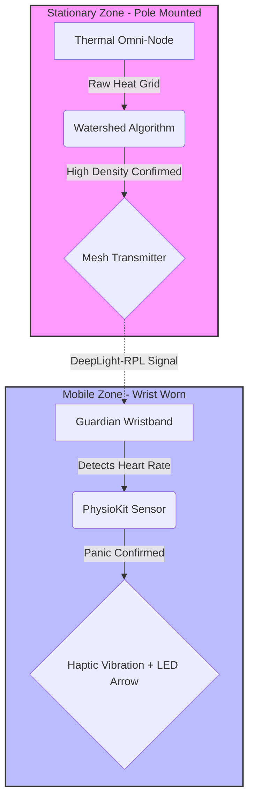

# Crowd OS: Distributed Thermal-Mesh Safety Grid

**Principal Architect:** Prasurjya Deka  
**Co-Contributor:** Aditiya Khanna  
**Contact:** prasurjyadeka130@gmail.com  

## 1. System Overview
Crowd OS is an infrastructure-dependent crowd safety architecture designed to mitigate crush asphyxia and stampede risks in high-density environments. It addresses the "Latency Trap" of CCTV and the "Connectivity Blackout" of cellular networks during mass events.

The system utilizes a novel **"Aggregate & Compare"** logic where **Stationary Thermal Sensors** (mounted on poles) detect crowd velocity, and **Wearable Wristbands** provide haptic guidance and triangulation.

> **⚠️ Prior Art & Patent Distinction**  
> This architecture is explicitly distinct from "body-worn" safety devices described in **US Patent 12392583B2** (GovGPT Inc.). Crowd OS strictly utilizes **stationary infrastructure nodes** (clamped to poles/walls) for threat detection. It does **not** employ visual sensors or cameras integrated into tactical gear for threat identification.

---

## 2. Key Features & Innovations

### A. The "Density-Crusher" (Stampede Prevention)
*   **The Problem:** In high-density zones (e.g., mosh pits), standard cameras fail to count people when they merge into a single "blob."
*   **The Solution:** We utilize **AMG8833 Thermal Omni-Nodes** combined with **Bicubic Interpolation** (to upscale low-res heat grids) and the **Watershed Algorithm**. This mathematically separates merged heat blobs to accurately count individuals even when standing shoulder-to-shoulder.

### B. Silent Guidance (Directional Navigation)
*   **The Problem:** Loudspeakers are inaudible during concerts or panic.
*   **The Solution:** The "Guardian Band" provides **Visual Biofeedback**. If an exit is blocked, the band vibrates and displays a **Dynamic LED Arrow** on the 1.44" screen, silently guiding the crowd toward the nearest *low-density* exit, balancing the crowd flow automatically.

### C. Rapid Reunion (Locating Lost People)
*   **The Problem:** GPS fails indoors and under tents; cellular networks jam during mass events.
*   **The Solution:** The system uses **Mesh Network Triangulation** (DeepLight-RPL protocol). Organizers can query a specific wristband ID (e.g., a lost child), and the grid triangulates their exact position relative to the thermal nodes, facilitating rapid retrieval without relying on 4G/5G.

---

## 3. Technical Architecture

### A. The "SecureEvent" Logic Pipeline
The following diagram details the proprietary "Aggregate & Compare" decision tree designed by Prasurjya Deka. It visualizes the conversion of privacy-safe thermal grids into haptic safety guidance.

*Figure 1: The SecureEvent Architecture. Note the physical decoupling of the Stationary Thermal Node (Stage 1) from the Wearable Receiver (Stage 2).*

### B. Hardware Implementation (The Guardian Band)
The wearable component is a low-cost receiver-actuator node built on the open-source **PhysioKit** architecture.

*Figure 2: Hardware schematic of the Guardian Wristband. Featuring the RP2040 microcontroller, Haptic Motor, and 1.44" LED Display for directional arrows.*

**Component Specifications:**
*   **MCU:** RP2040 / ESP32-C3 (RISC-V)
*   **Bio-Sensor:** PPG (Photoplethysmography) Optical Heart Rate Sensor.
*   **Feedback:** Linear Resonant Actuator (LRA) + LED Display.
*   **Network:** DeepLight-RPL "Bucket Brigade" Mesh Protocol.

---

## 4. System Topology
The system utilizes a "Bucket Brigade" network topology to ensure signal propagation in dense crowds where human bodies attenuate RF signals.

--------------------------------------------------------------------------------
5. Citation & Attribution
If you use the concepts presented here for academic research, please cite this repository and the underlying open-source components.
BibTeX Entry:
@misc{deka2026crowdos,
  author = {Prasurjya,Deka},
  title = {Crowd OS: Distributed Thermal-Mesh Safety Grid},
  year = {2026},
  publisher = {GitHub},
  journal = {GitHub repository},
  howpublished = {\url{https://github.com/Xavesz/Crowd-OS-Decentralized-Safety-Grid-}},
  note = {Prior Art Disclosure against US Patent 12392583B2}
}
Third-Party Components:
• PhysioKit: Joshi, J., Wang, K., & Cho, Y. (2023). PhysioKit: An Open-Source, Low-Cost Physiological Computing Toolkit. Sensors, 23(19), 8244. Licensed under CC BY 4.0.

--------------------------------------------------------------------------------
6. Commercial Licensing
Copyright © 2026 Prasurjya Deka. All Rights Reserved.
This repository serves as a Defensive Publication.
1. No Commercial Use: Unauthorized commercial reproduction, patenting, or sale of the "Stationary Thermal-Mesh" logic flow is strictly prohibited.
2. No Derivatives: Modification of the "SecureEvent" algorithm chain for redistribution is not permitted.
For licensing inquiries, collaboration, or academic verification, contact: 📧 prasurjyadeka130@gmail.com
