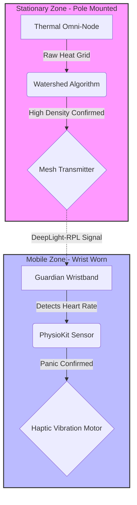

# Crowd OS: Distributed Thermal-Mesh Safety Grid

**Principal Architect:** Prasurjya Deka  
**Co-Contributor:** Aditiya Khanna  
**Contact:** prasurjyadeka130@gmail.com  

## 1. System Overview
Crowd OS is an infrastructure-dependent crowd safety architecture designed to mitigate crush asphyxia and stampede risks in high-density environments. Unlike GPS-based solutions (which fail indoors) or cellular-dependent alerts (which fail during network congestion), this system operates on a localized **DeepLight-RPL Mesh Network**.

The core innovation lies in the **"SecureEvent"** logic: a dual-validation protocol that cross-references **macro-crowd physics** (velocity/density) with **micro-biological data** (heart rate) to trigger autonomous evacuation guidance.

> **⚠️ Prior Art & Patent Distinction**  
> This architecture is explicitly distinct from "body-worn" safety devices described in **US Patent 12392583B2** (GovGPT Inc.). Crowd OS strictly utilizes **stationary infrastructure nodes** (clamped to poles/walls) for threat detection. It does **not** employ visual sensors or cameras integrated into tactical gear for threat identification.

---

## 2. Technical Architecture

### A. The "SecureEvent" Logic Pipeline
The following diagram details the proprietary "Aggregate & Compare" decision tree designed by Prasurjya Deka. It visualizes the conversion of privacy-safe thermal grids into haptic safety guidance.

*Figure 1: The SecureEvent Architecture. Note the physical decoupling of the Stationary Thermal Node (Stage 1) from the Wearable Receiver (Stage 2).*

#### Process Description
1.  **Stage 1 (Infrastructure):** A stationary **AMG8833 Thermal Sensor** captures an 8x8 heat grid. The system applies **Bicubic Interpolation** (to smooth the grid) followed by the **Watershed Algorithm** to separate merged heat blobs (distinct humans) and calculate velocity vectors ($v$).
2.  **Stage 2 (Wearable):** The **Guardian Band** captures raw PPG signals. Noise from motion artifacts is filtered using the **SQA-Phys 1D-CNN** model [Joshi et al., 2023].
3.  **Stage 3 (Aggregation):** The system triggers a "Code Red" only if the Boolean condition is met:  
    `IF (Infrastructure_Velocity > Threshold) AND (Cluster_HeartRate > Threshold)`

---

### B. Hardware Implementation (The Guardian Band)
The wearable component acts as a receiver-actuator node within the mesh network. It does not perform visual recording.

*Figure 2: Hardware schematic of the Guardian Wristband. Featuring the RP2040 microcontroller and haptic motor integration.*

**Component Specifications:**
*   **MCU:** RP2040 / ESP32-C3 (RISC-V)
*   **Bio-Sensor:** PPG (Photoplethysmography) Optical Heart Rate Sensor.
*   **Actuator:** Linear Resonant Actuator (LRA) for haptic feedback.
*   **Network:** 802.15.4 Mesh Protocol (Independent of LTE/5G).

---

## 3. System Topology
The system utilizes a "Bucket Brigade" network topology to ensure signal propagation in dense crowds where human bodies attenuate RF signals.

--------------------------------------------------------------------------------
4. Citation & Attribution
If you use the concepts presented here for academic research, please cite this repository and the underlying open-source components.
BibTeX Entry:
@misc{deka2026crowdos,
  author = {Prasurjya,Deka},
  title = {Crowd OS: Distributed Thermal-Mesh Safety Grid},
  year = {2026},
  publisher = {GitHub},
  journal = {GitHub repository},
  howpublished = {\url{https://github.com/Xavesz/Crowd-OS-Decentralized-Safety-Grid-}},
  note = {Prior Art Disclosure against US Patent 12392583B2}
}
Third-Party Components:
• PhysioKit: Joshi, J., Wang, K., & Cho, Y. (2023). PhysioKit: An Open-Source, Low-Cost Physiological Computing Toolkit. Sensors, 23(19), 8244. Licensed under CC BY 4.0.

--------------------------------------------------------------------------------
5. Commercial Licensing
Copyright © 2026 Prasurjya Deka. All Rights Reserved.
This repository serves as a Defensive Publication.
1. No Commercial Use: Unauthorized commercial reproduction, patenting, or sale of the "Stationary Thermal-Mesh" logic flow is strictly prohibited.
2. No Derivatives: Modification of the "SecureEvent" algorithm chain for redistribution is not permitted.
For licensing inquiries, collaboration, or academic verification, contact: 📧 prasurjyadeka130@gmail.com
